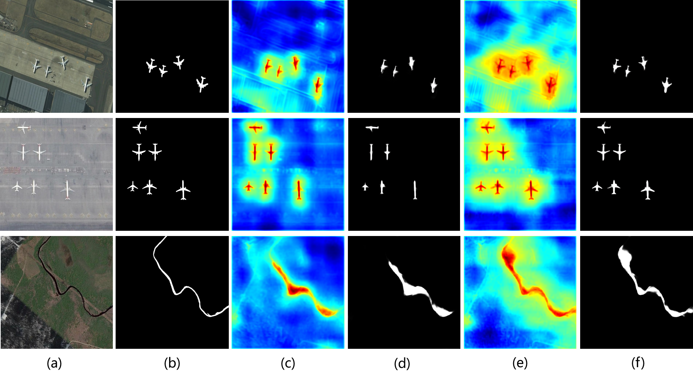

# SH-Net
## You can find our results on EORSSD and ORSSD dataset here: 链接：https://pan.baidu.com/s/1DG35rlwtWV8RBJnNTnzALQ 提取码：k9c4 

## Requirements
 Install Pytorch.
## Training data
The training data can be downloaed from [(EORSSD) Dataset](https://github.com/rmcong/EORSSD-dataset).
Our edge map from:https://github.com/yun-liu/rcf.

## Pretrained weights for backbone
The pretrianed weight for backbone can be downloaded from [VGG16].
(链接：https://pan.baidu.com/s/1hbIShLB-iYuRXy59iVvg8g 提取码：msrp).

# Test Model
1) Modify the testing image path accordingly.
2) You need to get the test images (链接：https://pan.baidu.com/s/1u8W5iGMPFnQCdhaV1d6FHw 提取码：6h6e).
3) Run ./test.py

# Our Results:

## Visualization

Code in visual.py helps generate visualization.

## Acknowledgement

Many thanks to [Weakly-Supervised Salient Object Detection via Scribble Annotations]  https://github.com/JingZhang617/Scribble_Saliency.

